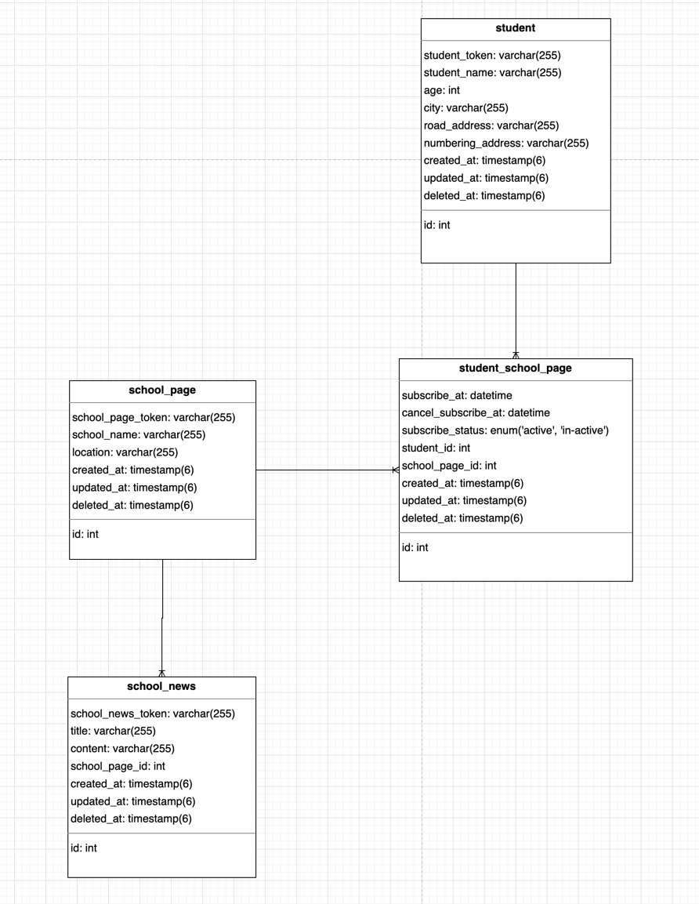
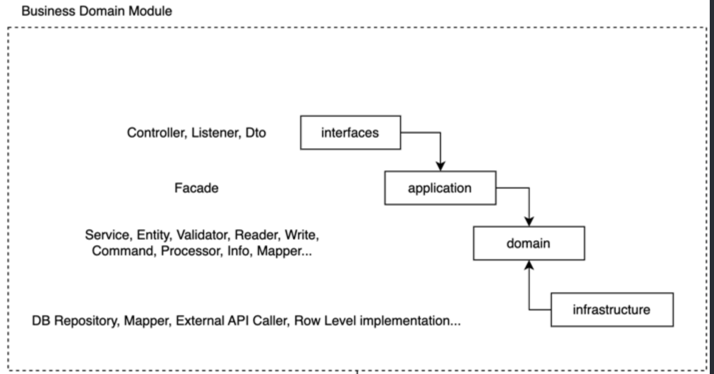
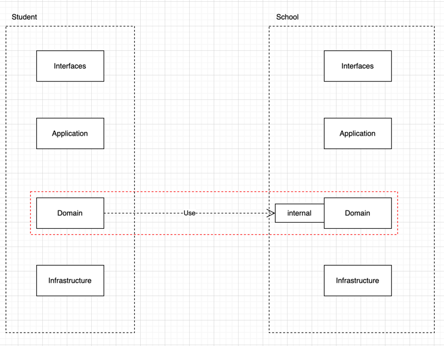
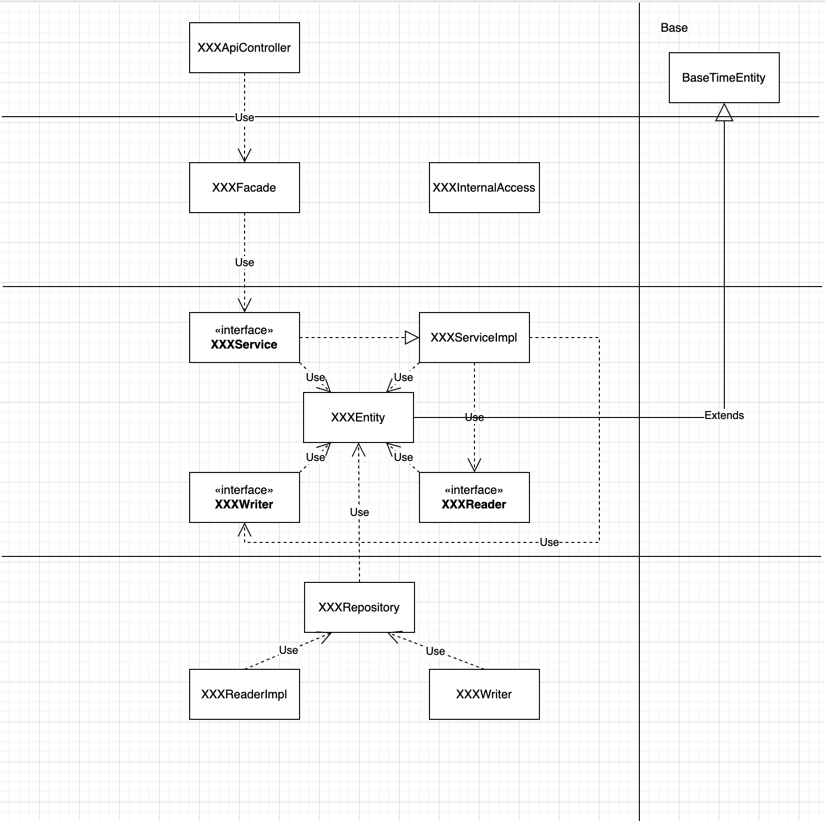

# 클래스팅 사전 과제

## ERD



---

## Software Architecture



<p>
- 기본적으로 DDD layered architecture를 차용해서 구현했습니다.<br>
- NestJS 는 Module 기반으로 컴포넌트를 구성하고 구동되기때문에 학생과 학교 비즈니스 도메인을 도출하여 구현헀습니다.<br>
- 비즈니스 도메인별로 나눈 이유는 역할과 책임이라는 개념을 도입하여 나눴습니다. 학생 도메인 모듈에는 학생 도메인에서 책임져야할 정책, 비즈니스 로직, 유효성 체크 등등 그 모듈 스스로 책임져야할 역할이 있기때문입니다.<br>
- 여기서 한가지 의문점은 NestJS Module 은 독립적인 개념이고, 다른 모듈에 있는 엔티티를 사용하려면 어떡하나 저는 아래 처럼 스스로 합의를 봐서 진행했습니다.<br>

1. 각 모듈에 포함되는 domain/*.entity 끼리는 서로 참조할 수 있다.<br>
2. 모듈별로 데이터 요청 및 반환은 shared module 이용하여 참조한다.<br>
3. 단, 내부적으로 데이터를 요청하는거기때문에 `internal` 이라는 디렉토리내에서 한정하여 다른 모듈들이 쓸 수 있게 한다.


</p>

---

## Class Diagram



<p>
- Domain 레이어에서는 interface 로 작성하여 domain 내에서만 의존성을 갖게끔 처리했습니다.<br>
- Reader, Writer 는 엔티티 조회, 쓰기용 객체입니다. 해당 객체의 실제 구현체는 infrastructure 레이어에 배치하여 OCP, DIP 를 준수했습니다.<br>
  이로써 얻는 효과는 Domain 은 다른 레이어에 의존성을 안갖게되므로 응집력을 높일수 있고, 또한 실제 구현체는 low-level 로 내리니 구현체가 바뀌어도 Domain 레어어에서는 변화없이 유지할 수 있습니다.<br>
- BaseTimeEntity 엔티티는 생성/수정/삭제/id 값이 포함되어있고, 모든 엔티티는 readonly 프로퍼티로 선언하였기때문에 상태 변경 할 수 있는 함수를 제작하여 자식 엔티티들이 해당 함수로만 변경이 가능하게끔 처리했습니다.<br>
</p>

---

## Run

### docker-compose up

docker-compose/mysql 폴더로 이동

```shell
docker-compose -f ./docker-compose.development.yml up -d
```

```shell
docker-compose -f ./docker-compose.production.yml up -d
```

### build

```shell
yarn build
```

### Run

#### Development

```shell
yarn start:dev
```

#### Production

```shell
yarn start:prod
```

---